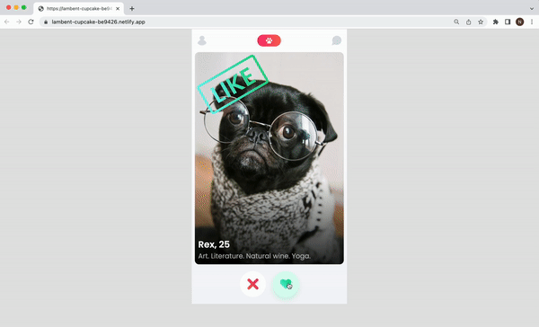

# Tindog

Tinder for dogs

## Features
Users can like or not a profile. After their decision a badge with their choice will be rendered and after a second they will see the next profile. When there will be no more profiles left, they will see a message.

## Demo

Test it on Netlify: https://lambent-cupcake-be9426.netlify.app/

## Technologies
The project is built using:
* HTML
* CSS
* JavaScript

## Technical details
* Used the data file and Javascript classes to render the profiles in JavaScript.
* Depending on the button pressed, a certain badge is rendered over the image.
* Added a short pause before the next profile is rendered.
* Users cannot press the buttons during this pause.
* Followed the design file on Figma.

## Project status
The project is complete.

## Acknowledgements
Tindog is a solo project that was part of [the Frontend Developer Career Path at Scrimba](https://scrimba.com/learn/frontend).

## Contact
Created by [Natalia Davtyan](https://github.com/nataliadavtyan)
